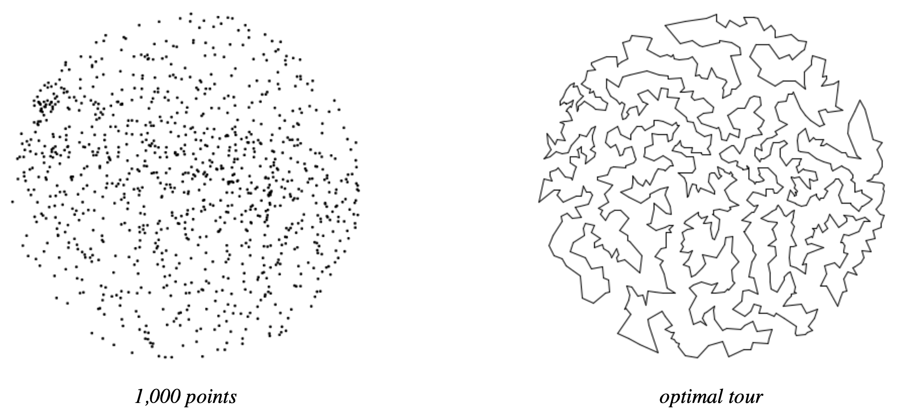

 

# T290 - Resolução de Problemas com Grafos
Orientador: Prof. Me Ricardo Carubbi

## T2 - Problema do Caixeira Viajante

 

### Introdução

Dado N pontos no plano, o objetivo do problema do caixeiro viajante (TSP) é visitar todos os pontos (e retornar ao ponto de partida) mantendo a distância total percorrida o mais curta possível. Você deve implementar duas heurísticas gulosas para encontrar boas (mas não necessariamente ótimas) soluções para o TSP.

 

### Perspectiva

A importância do TSP não está apenas em vendedores minimizando distâncias, mas em diversas aplicações: roteamento de veículos, perfuração de placas de circuito, projeto VLSI, controle de robôs, cristalografia de raios-X, escalonamento de tarefas e biologia computacional.

### Heurísticas Gulosas

O TSP é um problema de otimização combinatória notoriamente difícil. Em princípio, pode-se enumerar todos os ciclos e escolher o menor, mas o número de ciclos é tão grande (\~N!) que isso é impraticável. Para grandes N, não existe método eficiente conhecido para garantir o melhor ciclo.

Muitos métodos heurísticos foram estudados. Seu objetivo é implementar:

- **Heurística do Vizinho Mais Próximo:** Ler o próximo ponto e adicioná-lo ao ciclo após o ponto mais próximo.

### Tipo de dado Point

```java
public class Point {
    Point(double x, double y)  // cria o ponto (x, y)
    String toString()          // representação em string
    void draw()                // desenha o ponto
    void drawTo(Point that)    // desenha segmento até outro ponto
    double distanceTo(Point that)  // distância euclidiana
}
```

A classe `Point` é fornecida para uso.

### Tipo de dado Tour

Implemente a classe `Tour` representando o ciclo como uma lista encadeada circular de `Node`s:

```java
private class Node {
    private Point p;
    private Node next;
}
```

API da classe `Tour`:

```java
public class Tour {
    Tour()  // cria um ciclo vazio
    Tour(Point a, Point b, Point c, Point d) // cria ciclo a->b->c->d->a
    void show()
    void draw()
    int size()
    double distance()
    void insertNearest(Point p)
}
```

### Entrada e Testes

O formato de entrada é: dois inteiros w e h, seguidos por pares (x, y).

Exemplo de entrada (`tsp1000.txt`):

```
775 768
185.0411 457.8824
247.5023 299.4322
701.3532 369.7156
...
```

Template para implementar a heurística do vizinho mais próximo no Problema do Caixeiro Viajante (TSP). As atividades estão divididas em duas etapas: começar com a versão ingênua e, em seguida, otimizar com `KdTree`.

## Objetivo
As atividades estão divididas em duas etapas: começar com a versão ingênua e, em seguida, otimizar com `KdTree`.

1. Implementar `insertNearestNaive` em `Tour.java`, varrendo a lista encadeada circular para encontrar o vizinho mais próximo.
2. Implementar `algs4/KdTree.java` e adaptar `insertNearest` para utilizar `insertNearestKd`, reduzindo o custo de busca.
3. Preencher `questoes.txt` com respostas conceituais, comprimentos de tour e medições de tempo (comparando as duas abordagens).

## Estrutura do template
- `src/`: classes principais (`Tour`, `Point`, `NearestInsertion`, `TSPVisualizer`, `TSPTimer`).
- `algs4/`: utilitários necessários da biblioteca algs4, incluindo um stub de `KdTree`.
- `data/`: coloque aqui os arquivos de teste (p. ex. `tsp10.txt`, `tsp100.txt`, ...).
- `results/`: contém referências de saída para `tsp10.txt`.
- `docs/`: contém referência para diversas heurísticas para o problema.

## Fluxo sugerido
1. Complete os métodos faltantes em `Tour` utilizando apenas a varredura ingênua e valide com `NearestInsertion`.
2. Implemente `KdTree` e a versão otimizada, comparando os tempos com `TSPTimer` (semente fixa em `StdRandom.setSeed(123456789L)`).
3. Atualize `questoes.txt` com os comprimentos obtidos e as tabelas de tempo (ingênuo vs. `KdTree`).

## Compilação 
No diretório raiz do projeto, execute:

```bash
javac -cp src src/algs4/*.java src/*.java 
```
## Execução
```bash
java -cp src NearestInsertion data/tsp10.txt
java -cp src TSPVisualizer data/tsp10.txt 
java -cp src TSPTimer 10
```

## Referências de resultado
- `results/tsp10-nearest.ans`: evolução do tour gerado pela heurística nearest (útil para depurar).
- `results/tsp10-optimal.ans`: solução ótima conhecida para comparação.

## Entrega
Submeta `Tour.java` e `questoes.txt` preenchidos com as análises solicitadas.